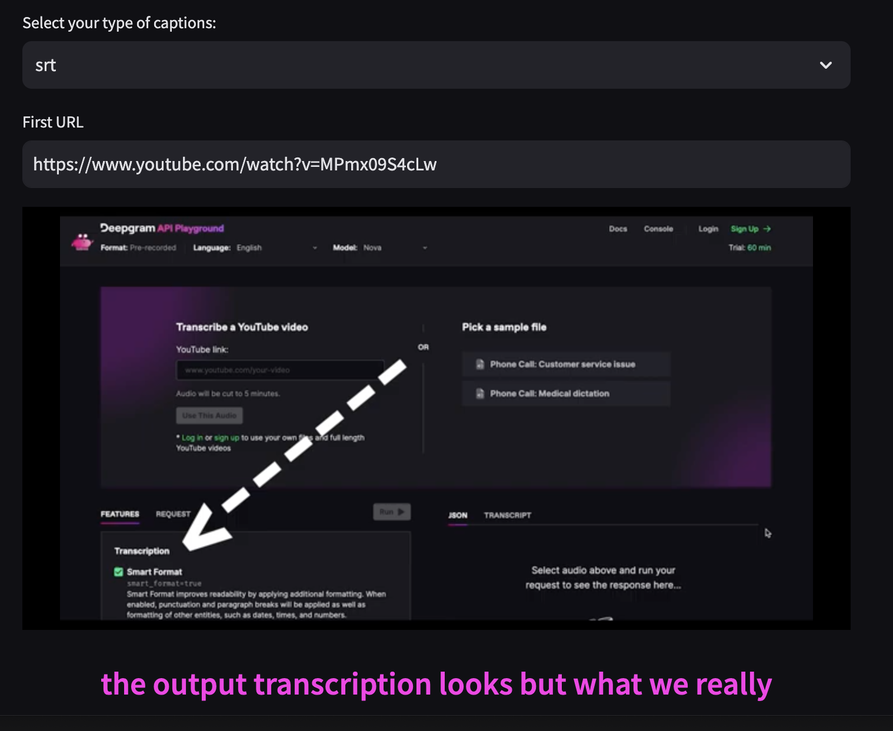

# Deepgram Captions Demo

[](https://discord.gg/xWRaCDBtW4)

This demo showcases the open source python package [deepgram-captions](https://github.com/deepgram/deepgram-python-captions), a package for creating srt and webvtt captions from several popular speech-to-text APIs, including Deepgram, whisper-timestamped, and others.

## The demo in action

Click the play button on the video player. The app will download the youtube file as an audio file, send that audio file to Deepgram to be transcribed, and then take the text transcription and convert it into srt and webvtt captions.

You can switch between srt and webvtt with the dropdown select menu. Add a different youtube video if you want, and click the copy button to copy the captions when they appear in the text block below.



## 🚀 Quick Start

1. Install all the packages:
   ```bash
   pip install -r requirements.txt
   ```
2. Run the demo:
   ```bash
   streamlit run app.py
   ```
3. View the Streamlit app in your browser: `http://localhost:8501`

## Which Speech-to-Text API?

It is not required to use Deepgram with the deepgram-captions package. You can use a different speech-to-text API, and if you find that it isn't supported by the package, feel free to make a request to the Deepgram Developer Relations team, and we'll do our best to add it. Reach out to us in Discord or at devrel@deepgram.com.

## Deepgram

[Deepgram](https://deepgram.com/) is a foundational AI company providing the speech-to-text and language understanding capabilities you need to make your data readable and actionable by human or machines.

You can learn more about the Deepgram API at [developers.deepgram.com](https://developers.deepgram.com/docs).

## Development and Contributing

Interested in contributing? We ❤️ pull requests!

To make sure our community is safe for all, be sure to review and agree to our
[Code of Conduct](./.github/CODE_OF_CONDUCT.md). Then see the
[Contribution](./.github/CONTRIBUTING.md) guidelines for more information.

## Getting Help

We love to hear from you so if you have questions, comments or find a bug in the
project, let us know! You can either:

- [Open an issue in this repository](https://github.com/deepgram/[reponame]/issues/new)
- [Join the Deepgram Github Discussions Community](https://github.com/orgs/deepgram/discussions)
- [Join the Deepgram Discord Community](https://discord.gg/xWRaCDBtW4)

[license]: LICENSE.txt
